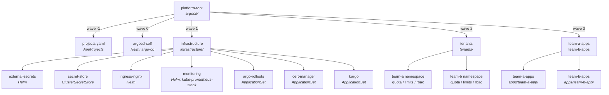
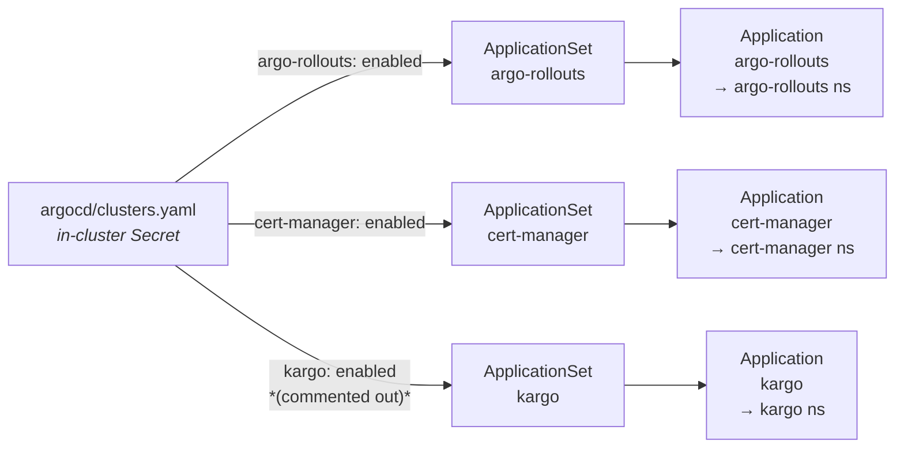
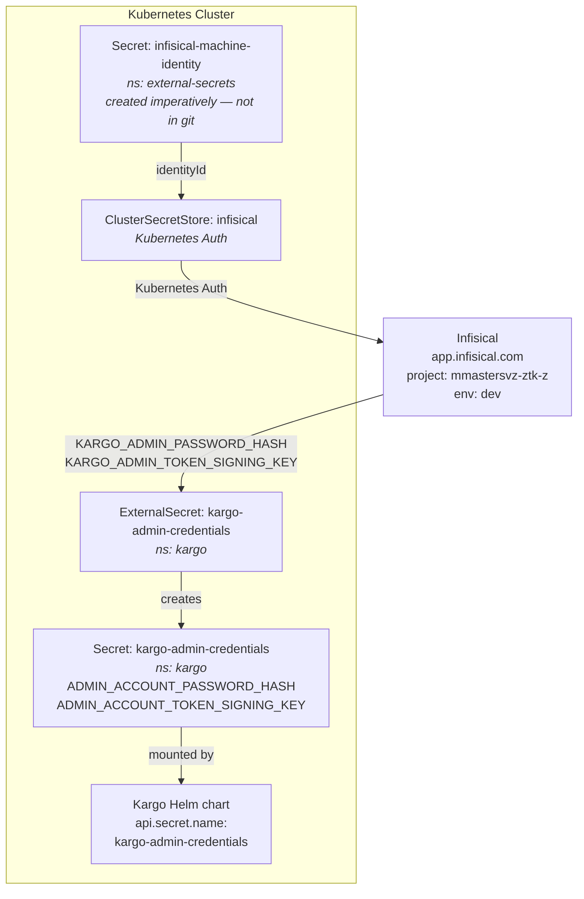
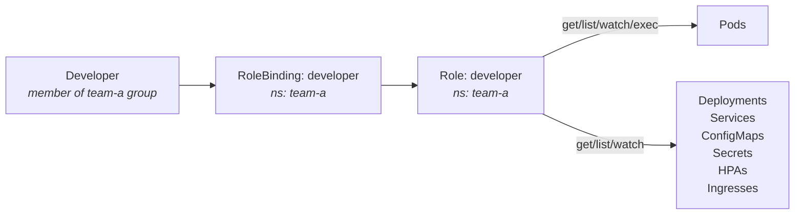

# platform-gitops

GitOps repository for the local [k3d](https://k3d.io) platform cluster, managed by [ArgoCD](https://argo-cd.readthedocs.io) using the App-of-Apps pattern.

---

## Table of Contents

- [platform-gitops](#platform-gitops)
  - [Table of Contents](#table-of-contents)
  - [Architecture Overview](#architecture-overview)
  - [Prerequisites](#prerequisites)
  - [Bootstrap](#bootstrap)
    - [Infisical Machine Identity (one-time, imperative)](#infisical-machine-identity-one-time-imperative)
  - [Directory Structure](#directory-structure)
  - [Sync Waves](#sync-waves)
  - [Conditional Deployment via Cluster Labels](#conditional-deployment-via-cluster-labels)
  - [Secret Management](#secret-management)
    - [Secrets reference](#secrets-reference)
    - [Adding a new secret](#adding-a-new-secret)
  - [ArgoCD Applications](#argocd-applications)
  - [RBAC Model](#rbac-model)
    - [Kubernetes RBAC](#kubernetes-rbac)
    - [ArgoCD AppProject](#argocd-appproject)
  - [Port-Forwards (Local Dev)](#port-forwards-local-dev)
  - [Adding a New Team](#adding-a-new-team)
  - [Adding a New Infrastructure Component](#adding-a-new-infrastructure-component)
    - [Always-on component](#always-on-component)
    - [Conditionally deployed component](#conditionally-deployed-component)

---

## Architecture Overview

The repository uses a three-layer App-of-Apps pattern. A single root application watches the `argocd/` directory and creates all other ArgoCD Application and ApplicationSet objects, which in turn manage their respective paths in the repo.



---

## Prerequisites

| Tool | Purpose | Install |
|------|---------|---------|
| [k3d](https://k3d.io) | Local Kubernetes cluster | `brew install k3d` |
| [kubectl](https://kubernetes.io/docs/tasks/tools/) | Cluster interaction | `brew install kubectl` |
| [argocd CLI](https://argo-cd.readthedocs.io/en/stable/cli_installation/) | App management | `brew install argocd` |
| [helm](https://helm.sh/docs/intro/install/) | Chart rendering | `brew install helm` |

The cluster must be bootstrapped via [platform-bootstrap](https://github.com/mmastersvz/platform-bootstrap) before applying this repo.

---

## Bootstrap

After the cluster is up, initialize ArgoCD with:

```bash
make init
```

This will:
1. Prompt for a GitHub PAT and create a repo credential secret in ArgoCD
2. Apply the `platform` AppProject
3. Apply the root App-of-Apps, which recursively syncs this repo

### Infisical Credentials (one-time, imperative)

The `ClusterSecretStore` authenticates with Infisical using Universal Auth. Before syncing, create the credentials Secret manually — this is intentionally not committed to git:

```bash
kubectl create secret generic infisical-credentials \
  --namespace external-secrets \
  --from-literal=clientId=<your-client-id> \
  --from-literal=clientSecret=<your-client-secret>
```

Get the client ID and secret from [Infisical](https://app.infisical.com) → Organization Settings → Machine Identities → Universal Auth.

---

## Directory Structure

```text
platform-gitops/
│
├── argocd/                             # ArgoCD objects — synced by platform-root
│   ├── root-app.yaml                   # Root App-of-Apps; watches argocd/ recursively
│   ├── argocd-self.yaml                # ArgoCD self-managed via Helm
│   ├── projects.yaml                   # AppProjects: platform, team-a, team-b
│   ├── clusters.yaml                   # In-cluster Secret with feature labels
│   ├── infrastructure-apps.yaml        # Application syncing infrastructure/
│   ├── tenants-apps.yaml               # Application syncing tenants/
│   └── apps.yaml                       # Per-team Applications
│
├── infrastructure/                     # Platform components (app-of-apps layer)
│   ├── external-secrets.yaml           # External Secrets Operator (Helm)
│   ├── secret-store.yaml               # Application → infrastructure/secret-store/
│   ├── secret-store/
│   │   └── cluster-secret-store.yaml   # ClusterSecretStore: Infisical (mmastersvz-ztk-z/dev)
│   ├── ingress-nginx.yaml              # Ingress controller (Helm)
│   ├── monitoring.yaml                 # kube-prometheus-stack: Prometheus + Grafana + Alertmanager
│   ├── argo-rollouts.yaml              # ApplicationSet — conditional on argo-rollouts label
│   ├── cert-manager.yaml               # ApplicationSet — conditional on cert-manager label
│   ├── kargo.yaml                      # ApplicationSet — conditional on kargo label
│   └── kargo-credentials.yaml         # ExternalSecret → kargo-admin-credentials Secret
│
├── tenants/                            # Per-team namespace setup (platform team manages)
│   ├── team-a/
│   │   ├── namespace.yaml              # wave 0
│   │   ├── quota.yaml                  # wave 1 — 2 CPU / 2Gi req, 4 CPU / 4Gi limit, 10 pods
│   │   ├── limits.yaml                 # wave 1 — default 200m/256Mi req, 500m/512Mi limit
│   │   └── rbac.yaml                   # wave 1 — developer Role + RoleBinding
│   └── team-b/
│       ├── namespace.yaml
│       ├── quota.yaml
│       ├── limits.yaml
│       └── rbac.yaml
│
├── apps/                               # Team workloads (each team owns their subdirectory)
│   ├── team-a-app/
│   │   ├── deployment.yaml
│   │   ├── service.yaml
│   │   └── hpa.yaml
│   └── team-b-app/
│       ├── deployment.yaml
│       └── service.yaml
│
├── Makefile
└── README.md
```

---

## Sync Waves

Sync waves enforce a deterministic bootstrap order. Resources in lower waves are fully healthy before higher waves begin.

```mermaid
gantt
    title ArgoCD Sync Wave Order
    dateFormat  X
    axisFormat  wave %s

    section argocd/
    AppProjects (projects.yaml)         :done, w0, -1, 0
    argocd-self + root-app              :done, w1, 0, 1
    infrastructure Application          :done, w2, 1, 2
    tenants Application                 :done, w3, 2, 3
    team-a-apps + team-b-apps           :done, w4, 3, 4

    section tenants/
    Namespace resources                 :done, t0, 0, 1
    Quota + LimitRange + RBAC           :done, t1, 1, 2

    section infrastructure/
    external-secrets + secret-store     :done, i1, 1, 2
    ingress-nginx + monitoring          :done, i2, 1, 2
    argo-rollouts + cert-manager        :done, i3, 1, 2
    kargo-credentials (ExternalSecret)  :done, i4, 29, 30
    kargo (ApplicationSet)              :done, i5, 30, 31
```



**Key ordering guarantees:**
- AppProjects exist before any Application references them (avoids "project not found" on clean bootstrap)
- Namespaces exist before ResourceQuota, LimitRange, and RBAC are applied
- `external-secrets` and the `ClusterSecretStore` are ready before `kargo-credentials` syncs
- `kargo-credentials` Secret exists before the Kargo Helm chart starts (wave 29 → 30)

---

## Conditional Deployment via Cluster Labels

[`argo-rollouts`](infrastructure/argo-rollouts.yaml), [`cert-manager`](infrastructure/cert-manager.yaml), and [`kargo`](infrastructure/kargo.yaml) are `ApplicationSet` resources that use the [cluster generator](https://argo-cd.readthedocs.io/en/stable/operator-manual/applicationset/Generators-Cluster/) to conditionally deploy based on cluster labels.



Cluster labels are managed in [`argocd/clusters.yaml`](argocd/clusters.yaml). To enable or disable a component, edit that file and push — ArgoCD will create or prune the Application automatically.

```yaml
# argocd/clusters.yaml
labels:
  argo-rollouts: enabled   # deployed
  cert-manager: enabled    # deployed
  # kargo: enabled         # not deployed — uncomment to enable
```

---

## Secret Management

Secrets are managed via [External Secrets Operator](https://external-secrets.io) backed by [Infisical](https://infisical.com). No secret values are stored in this repository.



### Secrets reference

All secrets that must exist in the cluster before or during bootstrap, with generation instructions.

---

#### `platform-gitops-repo` — GitHub PAT (ArgoCD repo credential)

**Namespace:** `argocd` | **Created by:** `make init` (interactive prompt)

ArgoCD needs read access to this repo. Create a [fine-grained PAT](https://github.com/settings/tokens?type=beta) with **Contents: Read** on `platform-gitops`, then run:

```bash
make init   # prompts for the PAT — does not echo to terminal
```

---

#### `infisical-machine-identity` — Infisical Kubernetes Auth

**Namespace:** `external-secrets` | **Created by:** manual `kubectl create secret`

The `ClusterSecretStore` authenticates to Infisical using [Kubernetes Auth](https://infisical.com/docs/documentation/platform/identities/kubernetes-auth). The `identityId` is the UUID shown on the machine identity detail page.

```
Infisical → Access Control → Machine Identities → <your identity> → copy ID
```

```bash
kubectl create secret generic infisical-machine-identity \
  --namespace external-secrets \
  --from-literal=identityId=<uuid-from-infisical>
```

This secret is intentionally not in git and must be created before ArgoCD syncs `secret-store`.

---

#### `kargo-admin-credentials` — Kargo admin password + signing key

**Namespace:** `kargo` | **Created by:** External Secrets Operator (pulled from Infisical)

The `kargo-credentials.yaml` ExternalSecret pulls two keys from Infisical and creates this Secret automatically. You must add the values to Infisical first.

**`KARGO_ADMIN_PASSWORD_HASH`** — bcrypt hash of your chosen admin password:

```bash
# requires: apt install apache2-utils  /  brew install httpd
htpasswd -bnBC 10 "" your-password | tr -d ':\n'

# or with Python (pip install bcrypt)
python3 -c "import bcrypt; print(bcrypt.hashpw(b'your-password', bcrypt.gensalt(10)).decode())"
```

**`KARGO_ADMIN_TOKEN_SIGNING_KEY`** — random string used to sign JWTs (no format requirement):

```bash
openssl rand -base64 48
```

Add both values to Infisical under project `mmastersvz-ztk-z` / environment `dev` using the exact key names `KARGO_ADMIN_PASSWORD_HASH` and `KARGO_ADMIN_TOKEN_SIGNING_KEY`. The ExternalSecret will sync them into the cluster within the configured `refreshInterval`.

---

### Adding a new secret

1. Add the secret value to Infisical under project `mmastersvz` / environment `development`
2. Create an `ExternalSecret` manifest referencing the `infisical` `ClusterSecretStore`
3. Reference the resulting Kubernetes Secret in your workload

```yaml
apiVersion: external-secrets.io/v1beta1
kind: ExternalSecret

metadata:
  name: my-secret
  namespace: team-a
spec:
  refreshInterval: 1h
  secretStoreRef:
    name: infisical
    kind: ClusterSecretStore
  target:
    name: my-secret
    creationPolicy: Owner
  data:
    - secretKey: MY_KEY
      remoteRef:
        key: MY_INFISICAL_SECRET_NAME
```

---

## ArgoCD Applications

| Application | Kind | Project | Source | Destination | Condition |
|-------------|------|---------|--------|-------------|-----------|
| `platform-root` | Application | `platform` | `argocd/` | cluster | always |
| `infrastructure` | Application | `platform` | `infrastructure/` | `argocd` ns | always |
| `tenants` | Application | `platform` | `tenants/` | cluster | always |
| `argocd-self` | Application | `platform` | Helm: [`argo-cd@5.51.6`](https://artifacthub.io/packages/helm/argo-cd/argo-cd) | `argocd` | always |
| `ingress-nginx` | Application | `platform` | Helm: [`ingress-nginx@4.9.0`](https://artifacthub.io/packages/helm/ingress-nginx/ingress-nginx) | `ingress-nginx` | always |
| `monitoring` | Application | `platform` | Helm: [`kube-prometheus-stack@56.6.2`](https://artifacthub.io/packages/helm/prometheus-community/kube-prometheus-stack) | `monitoring` | always |
| `external-secrets` | Application | `platform` | Helm: [`external-secrets@0.10.3`](https://artifacthub.io/packages/helm/external-secrets-operator/external-secrets) | `external-secrets` | always |
| `secret-store` | Application | `platform` | `infrastructure/secret-store/` | `external-secrets` | always |
| `argo-rollouts` | ApplicationSet | `platform` | Helm: [`argo-rollouts@2.40.9`](https://artifacthub.io/packages/helm/argo-rollouts/argo-rollouts) | `argo-rollouts` | `argo-rollouts: enabled` |
| `cert-manager` | ApplicationSet | `platform` | Helm: [`cert-manager@1.20.2`](https://artifacthub.io/packages/helm/cert-manager/cert-manager) | `cert-manager` | `cert-manager: enabled` |
| `kargo` | ApplicationSet | `platform` | Helm: [`kargo@1.10.0`](https://artifacthub.io/packages/helm/kargo/kargo) | `kargo` | `kargo: enabled` |
| `team-a-apps` | Application | `team-a` | `apps/team-a-app/` | `team-a` | always |
| `team-b-apps` | Application | `team-b` | `apps/team-b-app/` | `team-b` | always |

---

## RBAC Model

Access is enforced at two independent layers.

### Kubernetes RBAC

Each team namespace has a `developer` Role and RoleBinding bound to their group. Developers can observe workloads and exec into pods but cannot write resources — all changes go through GitOps.



To grant a user access:

```bash
kubectl create rolebinding <name> \
  --role=developer \
  --user=<user> \
  -n team-a
```

### ArgoCD AppProject

Each team has a dedicated [AppProject](https://argo-cd.readthedocs.io/en/stable/user-guide/projects/) scoped to their namespace:

| Constraint | team-a / team-b |
|---|---|
| Source repos | this repo only |
| Destination namespaces | `team-a` / `team-b` only |
| Cluster-scoped resources | blocked |
| Namespace-scoped resources | Deployment, StatefulSet, DaemonSet, Job, CronJob, HPA, PDB, Ingress, Service, ConfigMap, Secret, ServiceAccount |
| ArgoCD role | `proj:<team>:developer` — view and sync own apps only |

---

## Port-Forwards (Local Dev)

```bash
make pf              # start all port-forwards in parallel
make stop-pf         # stop all port-forwards

make argocd-pf       # ArgoCD UI      → http://localhost:9080
make grafana-pf      # Grafana        → http://localhost:9081
make prometheus-pf   # Prometheus     → http://localhost:9082
make alertmanager-pf # Alertmanager   → http://localhost:9083
```

The k3d load balancer exposes ingress-nginx directly on:

| Port | Protocol |
|------|----------|
| `8080` | HTTP |
| `8443` | HTTPS |

---

## Adding a New Team

1. Add an AppProject to [`argocd/projects.yaml`](argocd/projects.yaml) (copy `team-b`, adjust name/namespace)
2. Add an Application to [`argocd/apps.yaml`](argocd/apps.yaml) pointing to `apps/<team>-app/`
3. Create `tenants/<team>/` with `namespace.yaml`, `quota.yaml`, `limits.yaml`, `rbac.yaml`
4. Create `apps/<team>-app/` with workload manifests
5. Commit and push — ArgoCD syncs automatically

---

## Adding a New Infrastructure Component

### Always-on component

Add a Helm `Application` manifest to `infrastructure/` and it will be picked up by the `infrastructure` app on next sync.

### Conditionally deployed component

1. Add a new label to [`argocd/clusters.yaml`](argocd/clusters.yaml) for the feature flag
2. Write an `ApplicationSet` in `infrastructure/` using a cluster generator that selects on that label
3. Enable it on a cluster by adding the label to `argocd/clusters.yaml` for that cluster

```yaml
# argocd/clusters.yaml
labels:
  my-component: enabled
```

```yaml
# infrastructure/my-component.yaml
spec:
  generators:
    - clusters:
        selector:
          matchLabels:
            my-component: enabled
```
